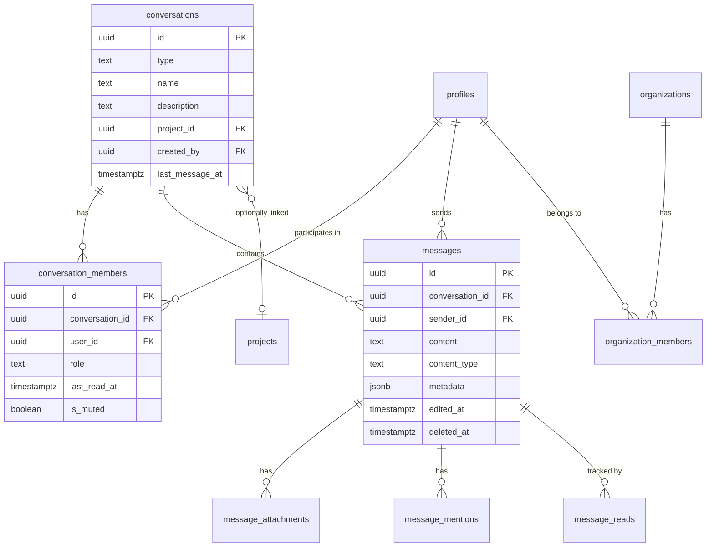

# OpenPlan AI — Chat Feature: Detailed Planning Document

> **Version:** 1.1  
> **Date:** February 19, 2026  
> **Status:** Planning & Design  
> **Author:** Planning Document for Sekhar

---

## 1. Executive Summary

This document outlines the complete planning, architecture, features, and implementation strategy for adding a **built-in chat system** to OpenPlan AI. The chat system will provide two core capabilities:

1. **Direct Messaging (DM)** — One-on-one private conversations between any two users who share at least one organization
2. **Group Conversations** — Multi-participant chat channels that can be tied to projects or created ad-hoc

The chat feature is designed to reduce context-switching for hardware development teams by keeping communication within the same tool where work is managed. It leverages the existing Supabase backend for real-time subscriptions and builds on the current tech stack (React 18, Zustand, TanStack Query, shadcn/ui).

> [!IMPORTANT]
> **Chat is a universal, user-level feature** — it is NOT scoped to any specific organization. All conversations persist regardless of which organization is currently selected. Users can message anyone they share at least one organization with. Switching organizations has zero effect on the chat inbox.

---

## 2. Goals & Objectives

### Primary Goals
- Enable real-time, persistent text-based communication between team members
- Support both 1:1 direct messages and multi-user group conversations
- Provide a universal chat inbox that works across all organizations
- Maintain consistency with OpenPlan AI's existing UI/UX patterns and design system

### Secondary Goals
- Provide contextual messaging (link tasks/issues in chat)
- Support file/attachment sharing in conversations
- Enable notification integration for unread messages
- Lay groundwork for future features (threads, reactions, audio/video)

### Non-Goals (v1)
- Audio/video calling
- End-to-end encryption
- Messaging users with no shared organization
- Threaded replies (planned for v2)
- Message reactions/emoji (planned for v2)

---

## 3. User Stories

### Direct Messaging
| # | User Story | Priority |
|---|-----------|----------|
| DM-1 | As a team member, I can start a direct conversation with any user I share at least one organization with | P0 |
| DM-2 | As a user, I can see a list of all my active DM conversations sorted by most recent | P0 |
| DM-3 | As a user, I can send text messages in real-time and see them appear instantly | P0 |
| DM-4 | As a user, I can see when a DM participant is online (presence indicator) | P1 |
| DM-5 | As a user, I can see read receipts (message seen status) | P2 |
| DM-6 | As a user, I can share files/attachments in a DM | P1 |
| DM-7 | As a user, I can search through my DM message history | P1 |
| DM-8 | As a user, I can delete my own messages | P1 |
| DM-9 | As a user, I can edit my own messages within a time window | P2 |

### Group Conversations
| # | User Story | Priority |
|---|-----------|----------|
| GC-1 | As a user, I can create a new group conversation with a name and selected participants | P0 |
| GC-2 | As a user, I can add or remove members from a group I admin | P0 |
| GC-3 | As a user, I can send messages to a group and all members see them in real-time | P0 |
| GC-4 | As a user, I can see the list of group conversations I belong to | P0 |
| GC-5 | As a user, I can see the member list and count for any group | P0 |
| GC-6 | As a user, I can set a group avatar/icon and description | P2 |
| GC-7 | As a user, I can leave a group conversation | P1 |
| GC-8 | As a group admin, I can archive (soft-delete) a group | P1 |
| GC-9 | As a user, I can create a project-specific group that auto-includes project members | P1 |

### Cross-Cutting
| # | User Story | Priority |
|---|-----------|----------|
| CC-1 | As a user, I see an unread message count badge on the sidebar chat icon | P0 |
| CC-2 | As a user, I receive toast/push notifications for new messages when chat is not in focus | P0 |
| CC-3 | As a user, I can mention (@mention) other team members in messages | P1 |
| CC-4 | As a user, I can reference tasks or issues (e.g., `#TASK-123`) in messages with auto-linking | P1 |
| CC-5 | As a user, I can format messages with basic markdown (bold, italic, code, links) | P1 |
| CC-6 | As a user, I can see typing indicators when others are composing messages | P2 |

---

## 4. Feature Specifications

### 4.1 Chat Navigation & Layout

**Sidebar Integration:**
- A new "Chat" item added to the main sidebar navigation (between "Reports" and "Team")
- Icon: `MessageSquare` from Lucide React
- Badge showing total unread message count across all conversations
- Route: `/chat`

**Chat Page Layout (3-Column):**
```
┌──────────────┬────────────────────────────────┬──────────────┐
│              │                                │              │
│  Conversation│       Message Area             │   Details    │
│  List        │                                │   Panel      │
│  (Sidebar)   │  ┌──────────────────────────┐  │  (Optional)  │
│              │  │   Message Bubbles        │  │              │
│  ┌─────────┐ │  │   ...                    │  │  Members     │
│  │ Search  │ │  │   ...                    │  │  Shared      │
│  └─────────┘ │  │                          │  │  Files       │
│              │  └──────────────────────────┘  │  Settings    │
│  DMs         │                                │              │
│  ─────────── │  ┌──────────────────────────┐  │              │
│  Groups      │  │   Message Input          │  │              │
│              │  │   [📎] [Type...] [Send]  │  │              │
│              │  └──────────────────────────┘  │              │
└──────────────┴────────────────────────────────┴──────────────┘
```

- **Left Panel (280px)**: Conversation list with search, tabs for "All", "DMs", "Groups"
- **Center Panel (flex)**: Active conversation with message history and input
- **Right Panel (280px, collapsible)**: Conversation details (members, shared files, pinned messages)

**Responsive Behavior:**
- On mobile: Full-screen conversation list → full-screen chat view (slide transition)
- Detail panel hidden on screens < 1024px

### 4.2 Direct Messaging

**Starting a New DM:**
1. Click "New Message" button (top of conversation list)
2. Opens a member search/select dialog
3. Shows all users who share at least one organization with the current user (aggregated across all orgs), with avatar, name, role
4. Selecting a user either opens existing DM or creates a new one
5. If DM already exists, navigates to it

> [!NOTE]
> The member list for starting new DMs is built by querying all users who share any `organization_members` record with the current user, regardless of which organization is currently selected.

**DM Conversation View:**
- Header: Recipient avatar, name, role, online status dot
- Message bubbles: Right-aligned for sender, left-aligned for recipient
- Each message shows: text, timestamp, read status (✓ sent, ✓✓ delivered, ✓✓ blue = read)
- Date separators between messages on different days
- "New messages" divider when scrolling up and new messages arrive

**Message Features (DM):**
- Plain text with markdown formatting support
- File attachments (reuse existing `attachments` infrastructure)
- @mentions with autocomplete
- Task/Issue linking with `#` prefix
- Copy, Edit (within 15 minutes), Delete own messages
- Emoji picker

### 4.3 Group Conversations

**Creating a Group:**
1. Click "New Group" button in the conversation list
2. Step 1: Enter group name and optional description
3. Step 2: Select members from any shared organization (minimum 2 others + creator)
4. Step 3: Optional — link to a project (auto-syncs project members)
5. Creator becomes group admin automatically

**Group Conversation View:**
- Header: Group name, member count, group avatar (generated from initials or custom)
- Messages show sender avatar + name above each message (or grouped if consecutive)
- Admin actions: Rename group, Add/Remove members, Archive group
- "X has joined/left the group" system messages

**Group Roles:**
| Role | Permissions |
|------|------------|
| **Admin** | Rename, add/remove members, archive, set description, promote others |
| **Member** | Send messages, share files, leave group |

**Project-Linked Groups:**
- When creating a group, optionally link it to a project
- Auto-includes all current project members
- When new members join the project, they can be auto-added (configurable)
- Project-linked groups show the project badge in the conversation list

### 4.4 Real-Time Features

**Supabase Realtime Channels:**

| Feature | Channel | Payload |
|---------|---------|---------|
| New Messages | `messages:{conversation_id}` | Full message object |
| Typing Indicators | `typing:{conversation_id}` | `{ user_id, is_typing }` |
| Presence / Online Status | `presence:chat:{user_id}` | User presence state |
| Unread Count | `unread:{user_id}` | Updated unread counts |
| Conversation Updates | `conversations:{user_id}` | New/updated conversations |

**Implementation Strategy:**
- Use Supabase Realtime `postgres_changes` for message inserts
- Use Supabase Realtime `broadcast` for typing indicators (ephemeral, no persistence)
- Use Supabase Realtime `presence` for online/offline status tracking
- Subscribe on mount, unsubscribe on unmount with cleanup

### 4.5 Message Input & Composition

**Input Area Features:**
- Auto-expanding textarea (1 line → max 6 lines)
- Send on Enter, Shift+Enter for new line
- Attachment button (📎) opens file picker
- File preview chips before sending
- @mention autocomplete dropdown (triggered by `@`)
- Task/issue reference autocomplete (triggered by `#`)
- Emoji picker button
- Character limit: 4,000 characters per message

**Attachment Handling:**
- Supported types: Images (jpg, png, gif, webp), Documents (pdf, doc, xlsx), Archives (zip)
- Max file size: 10MB per file, 5 files per message
- Upload to Supabase Storage bucket `chat-attachments`
- Inline image preview for image attachments
- Download button for non-image files

### 4.6 Search & Discovery

**Conversation Search (left panel):**
- Filters conversations by name (group name or participant name for DMs)
- Instant filtering as user types
- Clear button to reset search

**Message Search (within conversation):**
- Search icon in conversation header
- Opens search bar that filters messages within the active conversation
- Highlights matching text in results
- Navigate between matches with up/down arrows

**Global Message Search (v2):**
- Search across all conversations from the main search bar
- Results grouped by conversation with previews

### 4.7 Notification Integration

**In-App Notifications:**
- Unread badge count on sidebar "Chat" icon (red dot with number)
- Per-conversation unread count shown in the conversation list
- Bold text for conversations with unread messages
- Toast notification for new messages when not on the chat page
- Sound notification (opt-in via settings)

**Notification Settings (in Settings page):**
```
Chat Notifications
├── Direct Messages:     [On/Off]
├── Group Messages:      [On/Off]  
├── @Mentions Only:      [On/Off] (for groups)
├── Message Sound:       [On/Off]
├── Desktop Notifications: [On/Off]
└── Mute Conversation:   [Per conversation]
```

---

## 5. Database Schema Design

> [!IMPORTANT]
> **Chat tables are NOT scoped to organizations.** Conversations exist at the user level. There is no `organization_id` on the `conversations` table. Users discover each other for new conversations by querying shared organization memberships, but conversations themselves are independent of any organization.

### 5.1 New Tables

#### `conversations`
The central table representing a chat conversation (DM or group). Note: no `organization_id` — chat is universal.

```sql
CREATE TABLE conversations (
  id              UUID PRIMARY KEY DEFAULT gen_random_uuid(),
  type            TEXT NOT NULL CHECK (type IN ('direct', 'group')),
  name            TEXT,                      -- NULL for DMs, required for groups
  description     TEXT,                      -- Optional group description
  avatar_url      TEXT,                      -- Optional group avatar
  project_id      UUID REFERENCES projects(id),  -- Optional project link
  created_by      UUID REFERENCES profiles(id),
  created_at      TIMESTAMPTZ DEFAULT now(),
  updated_at      TIMESTAMPTZ DEFAULT now(),
  archived_at     TIMESTAMPTZ,               -- Soft delete for groups
  last_message_at TIMESTAMPTZ DEFAULT now(),  -- For sorting conversations
  
  CONSTRAINT conversations_name_check 
    CHECK (type = 'direct' OR name IS NOT NULL)
);

-- Index for fast lookups
CREATE INDEX idx_conversations_last_message ON conversations(last_message_at DESC);
CREATE INDEX idx_conversations_type ON conversations(type);
CREATE INDEX idx_conversations_project ON conversations(project_id) WHERE project_id IS NOT NULL;
```

#### `conversation_members`
Junction table for conversation participants with role tracking.

```sql
CREATE TABLE conversation_members (
  id              UUID PRIMARY KEY DEFAULT gen_random_uuid(),
  conversation_id UUID NOT NULL REFERENCES conversations(id) ON DELETE CASCADE,
  user_id         UUID NOT NULL REFERENCES profiles(id),
  role            TEXT NOT NULL DEFAULT 'member' CHECK (role IN ('admin', 'member')),
  joined_at       TIMESTAMPTZ DEFAULT now(),
  left_at         TIMESTAMPTZ,               -- NULL = active member
  last_read_at    TIMESTAMPTZ DEFAULT now(),  -- For unread tracking
  is_muted        BOOLEAN DEFAULT false,      -- Per-conversation mute
  notification_preference TEXT DEFAULT 'all' 
    CHECK (notification_preference IN ('all', 'mentions', 'none')),
  
  UNIQUE (conversation_id, user_id)
);

CREATE INDEX idx_conv_members_user ON conversation_members(user_id) WHERE left_at IS NULL;
CREATE INDEX idx_conv_members_conv ON conversation_members(conversation_id) WHERE left_at IS NULL;
```

#### `messages`
Individual chat messages within a conversation.

```sql
CREATE TABLE messages (
  id              UUID PRIMARY KEY DEFAULT gen_random_uuid(),
  conversation_id UUID NOT NULL REFERENCES conversations(id) ON DELETE CASCADE,
  sender_id       UUID NOT NULL REFERENCES profiles(id),
  content         TEXT NOT NULL,
  content_type    TEXT NOT NULL DEFAULT 'text' 
    CHECK (content_type IN ('text', 'system', 'file', 'mixed')),
  metadata        JSONB,                     -- For system messages, link previews, etc.
  parent_id       UUID REFERENCES messages(id),  -- For future threading
  edited_at       TIMESTAMPTZ,
  deleted_at      TIMESTAMPTZ,               -- Soft delete
  created_at      TIMESTAMPTZ DEFAULT now(),
  
  CONSTRAINT messages_content_length CHECK (char_length(content) <= 4000)
);

CREATE INDEX idx_messages_conversation ON messages(conversation_id, created_at DESC);
CREATE INDEX idx_messages_sender ON messages(sender_id);
CREATE INDEX idx_messages_search ON messages USING gin(to_tsvector('english', content));
```

#### `message_attachments`
Files attached to chat messages.

```sql
CREATE TABLE message_attachments (
  id          UUID PRIMARY KEY DEFAULT gen_random_uuid(),
  message_id  UUID NOT NULL REFERENCES messages(id) ON DELETE CASCADE,
  file_name   TEXT NOT NULL,
  file_path   TEXT NOT NULL,               -- Supabase storage path
  file_size   BIGINT,
  mime_type   TEXT,
  created_at  TIMESTAMPTZ DEFAULT now()
);

CREATE INDEX idx_msg_attachments_message ON message_attachments(message_id);
```

#### `message_mentions`
Tracks @mentions for notification targeting.

```sql
CREATE TABLE message_mentions (
  id          UUID PRIMARY KEY DEFAULT gen_random_uuid(),
  message_id  UUID NOT NULL REFERENCES messages(id) ON DELETE CASCADE,
  user_id     UUID NOT NULL REFERENCES profiles(id),
  created_at  TIMESTAMPTZ DEFAULT now()
);

CREATE INDEX idx_msg_mentions_user ON message_mentions(user_id);
```

#### `message_reads`
Tracks per-message read receipts at a granular level (optional, the `last_read_at` on `conversation_members` covers the common case).

```sql
CREATE TABLE message_reads (
  message_id  UUID NOT NULL REFERENCES messages(id) ON DELETE CASCADE,
  user_id     UUID NOT NULL REFERENCES profiles(id),
  read_at     TIMESTAMPTZ DEFAULT now(),
  
  PRIMARY KEY (message_id, user_id)
);
```

### 5.2 Entity Relationship Diagram



> [!NOTE]
> Organizations are only used for **member discovery** (finding who you can chat with). The `organization_members` table is queried to build the list of reachable users, but conversations themselves have no org foreign key.

### 5.3 Row-Level Security (RLS) Policies

```sql
-- Conversations: Users can only see conversations they are a member of
CREATE POLICY "Users can view their conversations"
  ON conversations FOR SELECT
  USING (
    id IN (
      SELECT conversation_id FROM conversation_members 
      WHERE user_id = auth.uid() AND left_at IS NULL
    )
  );

-- Messages: Users can only see messages in their conversations
CREATE POLICY "Users can view messages in their conversations"
  ON messages FOR SELECT
  USING (
    conversation_id IN (
      SELECT conversation_id FROM conversation_members 
      WHERE user_id = auth.uid() AND left_at IS NULL
    )
  );

-- Messages: Users can only insert messages in conversations they belong to
CREATE POLICY "Users can send messages to their conversations"
  ON messages FOR INSERT
  WITH CHECK (
    sender_id = auth.uid() AND
    conversation_id IN (
      SELECT conversation_id FROM conversation_members 
      WHERE user_id = auth.uid() AND left_at IS NULL
    )
  );

-- Messages: Users can only edit/delete their own messages
CREATE POLICY "Users can update own messages"
  ON messages FOR UPDATE
  USING (sender_id = auth.uid());
```

### 5.4 Database Functions (RPC)

```sql
-- Get or create a DM conversation between two users (no org scoping)
CREATE OR REPLACE FUNCTION get_or_create_dm(
  p_other_user_id UUID
) RETURNS UUID AS $$
DECLARE
  v_conversation_id UUID;
  v_shares_org BOOLEAN;
BEGIN
  -- Verify the two users share at least one organization
  SELECT EXISTS (
    SELECT 1 FROM organization_members om1
    JOIN organization_members om2 ON om1.organization_id = om2.organization_id
    WHERE om1.user_id = auth.uid() AND om2.user_id = p_other_user_id
  ) INTO v_shares_org;
  
  IF NOT v_shares_org THEN
    RAISE EXCEPTION 'Cannot start DM: users do not share any organization';
  END IF;

  -- Check if DM already exists between these two users (globally, not per org)
  SELECT c.id INTO v_conversation_id
  FROM conversations c
  JOIN conversation_members cm1 ON cm1.conversation_id = c.id AND cm1.user_id = auth.uid()
  JOIN conversation_members cm2 ON cm2.conversation_id = c.id AND cm2.user_id = p_other_user_id
  WHERE c.type = 'direct' 
    AND cm1.left_at IS NULL 
    AND cm2.left_at IS NULL;
    
  IF v_conversation_id IS NOT NULL THEN
    RETURN v_conversation_id;
  END IF;
  
  -- Create new DM conversation (no organization_id)
  INSERT INTO conversations (type, created_by)
  VALUES ('direct', auth.uid())
  RETURNING id INTO v_conversation_id;
  
  -- Add both members
  INSERT INTO conversation_members (conversation_id, user_id, role)
  VALUES 
    (v_conversation_id, auth.uid(), 'admin'),
    (v_conversation_id, p_other_user_id, 'admin');
    
  RETURN v_conversation_id;
END;
$$ LANGUAGE plpgsql SECURITY DEFINER;

-- Get all users reachable by the current user (share at least one org)
CREATE OR REPLACE FUNCTION get_reachable_users()
RETURNS TABLE(
  user_id UUID, 
  name TEXT, 
  email TEXT, 
  avatar_url TEXT, 
  initials TEXT,
  role TEXT
) AS $$
BEGIN
  RETURN QUERY
  SELECT DISTINCT
    p.id AS user_id,
    p.name,
    p.email,
    p.avatar_url,
    p.initials,
    p.role
  FROM profiles p
  JOIN organization_members om ON om.user_id = p.id
  WHERE om.organization_id IN (
    SELECT organization_id FROM organization_members 
    WHERE user_id = auth.uid()
  )
  AND p.id != auth.uid()
  AND p.deleted_at IS NULL;
END;
$$ LANGUAGE plpgsql SECURITY DEFINER;

-- Get unread message counts per conversation for a user
CREATE OR REPLACE FUNCTION get_unread_counts()
RETURNS TABLE(conversation_id UUID, unread_count BIGINT) AS $$
BEGIN
  RETURN QUERY
  SELECT 
    cm.conversation_id,
    COUNT(m.id) AS unread_count
  FROM conversation_members cm
  JOIN messages m ON m.conversation_id = cm.conversation_id
  WHERE cm.user_id = auth.uid()
    AND cm.left_at IS NULL
    AND m.created_at > cm.last_read_at
    AND m.sender_id != auth.uid()
    AND m.deleted_at IS NULL
  GROUP BY cm.conversation_id;
END;
$$ LANGUAGE plpgsql SECURITY DEFINER;

-- Mark conversation as read
CREATE OR REPLACE FUNCTION mark_conversation_read(p_conversation_id UUID)
RETURNS void AS $$
BEGIN
  UPDATE conversation_members
  SET last_read_at = now()
  WHERE conversation_id = p_conversation_id 
    AND user_id = auth.uid();
END;
$$ LANGUAGE plpgsql SECURITY DEFINER;
```

---

## 6. Frontend Architecture

### 6.1 Directory Structure

```
src/
├── features/
│   └── chat/                          # New feature module
│       ├── index.ts                   # Default export (Chat page)
│       ├── Chat.tsx                   # Main chat page (3-column layout)
│       ├── components/
│       │   ├── ConversationList.tsx    # Left panel - list of conversations
│       │   ├── ConversationItem.tsx    # Single conversation row in list
│       │   ├── ConversationSearch.tsx  # Search filter for conversations
│       │   ├── MessageArea.tsx        # Center panel - message display
│       │   ├── MessageBubble.tsx      # Individual message component
│       │   ├── MessageInput.tsx       # Bottom input area with toolbar
│       │   ├── MessageDateDivider.tsx # Date separator between messages
│       │   ├── SystemMessage.tsx      # "X joined", "X left" messages
│       │   ├── ChatHeader.tsx         # Conversation header with info
│       │   ├── DetailPanel.tsx        # Right panel - members, files
│       │   ├── NewDMDialog.tsx        # Start new DM dialog
│       │   ├── NewGroupDialog.tsx     # Create new group dialog
│       │   ├── MemberSelector.tsx     # Reusable member picker
│       │   ├── AttachmentPreview.tsx   # File attachment preview chip
│       │   ├── MentionAutocomplete.tsx # @mention dropdown
│       │   ├── EmojiPicker.tsx        # Emoji selection widget
│       │   ├── TypingIndicator.tsx    # "X is typing..." animation
│       │   ├── OnlineStatus.tsx       # Green/gray dot component
│       │   └── UnreadBadge.tsx        # Unread count badge
│       └── utils/
│           ├── chatHelpers.ts         # Message formatting, grouping
│           └── mentionParser.ts       # Parse @mentions and #references
│
├── services/
│   └── chat.service.ts                # Chat API/Supabase service layer
│
├── hooks/
│   ├── useChat.ts                     # React Query hooks for chat
│   ├── useChatRealtime.ts            # Supabase realtime subscription hook
│   └── useChatPresence.ts            # Online presence tracking hook
│
└── stores/
    └── useChatStore.ts                # Zustand store for chat UI state
```

### 6.2 Key TypeScript Types

```typescript
// New types to add in src/types/index.ts or src/features/chat/types.ts

type ConversationType = 'direct' | 'group';
type MessageContentType = 'text' | 'system' | 'file' | 'mixed';
type ConversationMemberRole = 'admin' | 'member';
type NotificationPreference = 'all' | 'mentions' | 'none';

interface Conversation {
  id: string;
  type: ConversationType;
  name: string | null;           // null for DMs (show other user's name)
  description: string | null;
  avatarUrl: string | null;
  projectId: string | null;
  createdBy: string;
  createdAt: string;
  updatedAt: string;
  archivedAt: string | null;
  lastMessageAt: string;
  
  // Populated via joins
  members: ConversationMember[];
  lastMessage?: ChatMessage;
  unreadCount: number;
}

interface ConversationMember {
  id: string;
  conversationId: string;
  userId: string;
  role: ConversationMemberRole;
  joinedAt: string;
  leftAt: string | null;
  lastReadAt: string;
  isMuted: boolean;
  notificationPreference: NotificationPreference;
  
  // Populated via join
  profile: {
    id: string;
    name: string;
    email: string;
    avatarUrl: string | null;
    initials: string;
    role: string | null;
  };
}

interface ChatMessage {
  id: string;
  conversationId: string;
  senderId: string;
  content: string;
  contentType: MessageContentType;
  metadata: Record<string, any> | null;
  parentId: string | null;
  editedAt: string | null;
  deletedAt: string | null;
  createdAt: string;
  
  // Populated via joins
  sender: {
    id: string;
    name: string;
    avatarUrl: string | null;
    initials: string;
  };
  attachments: MessageAttachment[];
  mentions: string[];  // user IDs
}

interface MessageAttachment {
  id: string;
  messageId: string;
  fileName: string;
  filePath: string;
  fileSize: number | null;
  mimeType: string | null;
  url: string;          // Generated Supabase storage URL
}
```

### 6.3 Zustand Store Design

```typescript
// useChatStore.ts
interface ChatState {
  // Active state
  activeConversationId: string | null;
  isDetailPanelOpen: boolean;
  
  // Composition
  draftMessages: Record<string, string>;   // conversationId -> draft text
  replyingTo: ChatMessage | null;
  editingMessage: ChatMessage | null;
  
  // Filters
  conversationFilter: 'all' | 'dms' | 'groups';
  searchQuery: string;
  
  // UI State
  isNewDMDialogOpen: boolean;
  isNewGroupDialogOpen: boolean;
  
  // Unread tracking (client-side cache)
  unreadCounts: Record<string, number>;  // conversationId -> count
  totalUnread: number;
  
  // Actions
  setActiveConversation: (id: string | null) => void;
  toggleDetailPanel: () => void;
  setDraftMessage: (conversationId: string, text: string) => void;
  setReplyingTo: (message: ChatMessage | null) => void;
  setEditingMessage: (message: ChatMessage | null) => void;
  setConversationFilter: (filter: 'all' | 'dms' | 'groups') => void;
  setSearchQuery: (query: string) => void;
  updateUnreadCount: (conversationId: string, count: number) => void;
  markAsRead: (conversationId: string) => void;
}
```

### 6.4 React Query Hooks

```typescript
// useChat.ts — key hooks

// Fetch all conversations for the current user (universal, no org filter)
useConversations()

// Fetch reachable users for starting new conversations
useReachableUsers()

// Fetch messages for a specific conversation (with pagination)
useMessages(conversationId: string, options?: { limit: number; cursor?: string })

// Send a new message
useSendMessage()

// Edit a message
useEditMessage()

// Delete a message (soft delete)
useDeleteMessage()

// Create a group conversation
useCreateGroup()

// Get or create a DM
useGetOrCreateDM()

// Add/remove group members
useAddGroupMember()
useRemoveGroupMember()

// Mark conversation as read
useMarkAsRead()

// Get unread counts
useUnreadCounts()

// Upload chat attachment
useUploadChatAttachment()
```

### 6.5 Service Layer

```typescript
// chat.service.ts — service methods

class ChatService {
  // Conversations (no org scoping — universal inbox)
  getConversations(): Promise<Conversation[]>
  getConversation(id: string): Promise<Conversation>
  createGroupConversation(data: CreateGroupInput): Promise<Conversation>
  getOrCreateDM(otherUserId: string): Promise<string>  // via RPC
  archiveConversation(id: string): Promise<void>
  getReachableUsers(): Promise<ReachableUser[]>  // via RPC
  updateGroupDetails(id: string, data: UpdateGroupInput): Promise<void>
  
  // Members
  addMember(conversationId: string, userId: string): Promise<void>
  removeMember(conversationId: string, userId: string): Promise<void>
  leaveConversation(conversationId: string): Promise<void>
  updateMemberSettings(conversationId: string, settings: MemberSettings): Promise<void>
  
  // Messages
  getMessages(conversationId: string, opts: PaginationOpts): Promise<ChatMessage[]>
  sendMessage(data: SendMessageInput): Promise<ChatMessage>
  editMessage(id: string, content: string): Promise<void>
  deleteMessage(id: string): Promise<void>  // soft delete
  
  // Read tracking
  markAsRead(conversationId: string): Promise<void>
  getUnreadCounts(): Promise<Record<string, number>>
  
  // Attachments
  uploadAttachment(file: File, conversationId: string): Promise<MessageAttachment>
  
  // Search
  searchMessages(conversationId: string, query: string): Promise<ChatMessage[]>
}
```

---

## 7. Routing

### New Routes

```typescript
// Add to App.tsx routes (protected)
<Route path="/chat" element={<Chat />} />
<Route path="/chat/:conversationId" element={<Chat />} />
```

| Route | Page | Description |
|-------|------|-------------|
| `/chat` | Chat | Chat page with no conversation selected (shows placeholder) |
| `/chat/:conversationId` | Chat | Chat page with specific conversation open |

### Sidebar Navigation Update

Add to `mainNavItems` in `AppSidebar.tsx`:
```typescript
{
  title: 'Chat',
  url: '/chat',
  icon: MessageSquare,
  badge: totalUnread  // Dynamic unread count
}
```

---

## 8. Real-Time Architecture

### 8.1 Supabase Realtime Subscriptions

```typescript
// useChatRealtime.ts

// 1. Message subscription — listen for new messages in active conversation
supabase
  .channel(`messages:${conversationId}`)
  .on('postgres_changes', {
    event: 'INSERT',
    schema: 'public',
    table: 'messages',
    filter: `conversation_id=eq.${conversationId}`
  }, handleNewMessage)
  .on('postgres_changes', {
    event: 'UPDATE',
    schema: 'public',
    table: 'messages',
    filter: `conversation_id=eq.${conversationId}`
  }, handleMessageUpdate)
  .subscribe();

// 2. Conversation updates — listen across all user's conversations  
supabase
  .channel(`conversations:${userId}`)
  .on('postgres_changes', {
    event: '*',
    schema: 'public',
    table: 'conversations',
  }, handleConversationUpdate)
  .subscribe();

// 3. Typing indicators — broadcast channel (no persistence)
const typingChannel = supabase.channel(`typing:${conversationId}`);
typingChannel.on('broadcast', { event: 'typing' }, handleTyping);

// To send typing status:
typingChannel.send({
  type: 'broadcast',
  event: 'typing',
  payload: { userId, isTyping: true }
});

// 4. Presence — online/offline tracking (user-level, not org-scoped)
const presenceChannel = supabase.channel(`presence:chat:${userId}`);
presenceChannel.on('presence', { event: 'sync' }, () => {
  const presenceState = presenceChannel.presenceState();
  // Update online users across all shared organizations
});
presenceChannel.track({ userId, onlineAt: new Date().toISOString() });
```

### 8.2 Optimistic Updates

For the best user experience, messages should appear instantly:

1. **Send message** → Immediately add to local query cache with `status: 'sending'`
2. **Server confirms** → Update message with real `id` and `created_at`, set `status: 'sent'`
3. **Error** → Mark message as `status: 'failed'`, show retry button
4. **Real-time receives own message** → Deduplicate (skip if already in cache)

---

## 9. UI/UX Design Specifications

### 9.1 Color & Theme

Chat follows the existing OpenPlan AI design system:

| Element | Light Mode | Dark Mode |
|---------|-----------|-----------|
| Sender bubble | `hsl(var(--primary))` with white text | Same |
| Receiver bubble | `hsl(var(--muted))` with foreground text | Same |
| System message | `hsl(var(--muted-foreground))` italic | Same |
| Unread badge | `hsl(var(--destructive))` | Same |
| Online dot | `#22C55E` (green-500) | Same |
| Offline dot | `hsl(var(--muted-foreground))` | Same |
| Typing indicator | `hsl(var(--muted-foreground))` animated dots | Same |

### 9.2 Animations & Transitions

- **New message**: Slide up with fade-in (200ms ease-out)
- **Conversation switch**: Cross-fade (150ms)
- **Detail panel**: Slide from right (300ms ease-in-out)
- **Typing indicator**: Three bouncing dots animation (0.6s loop)
- **Unread badge**: Scale-in pop animation (200ms)
- **Online status**: Fade transition (300ms)

### 9.3 Empty States

| State | Illustration | Text |
|-------|-------------|------|
| No conversations | Chat bubble illustration | "No conversations yet. Start chatting with your team!" |
| No conversation selected | Arrow pointing left | "Select a conversation or start a new one" |
| No messages in conversation | Wave emoji | "Send the first message to start the conversation" |
| No search results | Search icon | "No conversations matching your search" |

### 9.4 Keyboard Shortcuts

| Shortcut | Action |
|----------|--------|
| `Enter` | Send message |
| `Shift + Enter` | New line |
| `Escape` | Cancel edit/reply, close panels |
| `Ctrl/Cmd + K` | Search conversations |
| `Ctrl/Cmd + N` | New conversation |
| `↑` (in empty input) | Edit last sent message |

---

## 10. Implementation Phases

### Phase 1: Foundation (Week 1-2) — P0 Core

**Goal:** Basic DM and group messaging with real-time delivery

| Task | Effort | Priority |
|------|--------|----------|
| Database schema creation (migrations) | 1 day | P0 |
| RLS policies and RPC functions | 1 day | P0 |
| `chat.service.ts` — core CRUD operations | 1 day | P0 |
| Types and interfaces | 0.5 day | P0 |
| `useChatStore.ts` — Zustand store | 0.5 day | P0 |
| `useChat.ts` — React Query hooks | 1 day | P0 |
| `Chat.tsx` — main page layout (3-column) | 1 day | P0 |
| `ConversationList.tsx` — sidebar with DM/group tabs | 1 day | P0 |
| `MessageArea.tsx` — message display with scroll | 1 day | P0 |
| `MessageBubble.tsx` — message rendering | 0.5 day | P0 |
| `MessageInput.tsx` — text input with send | 0.5 day | P0 |
| `ChatHeader.tsx` — conversation header | 0.5 day | P0 |
| `NewDMDialog.tsx` — start DM flow | 0.5 day | P0 |
| `NewGroupDialog.tsx` — create group flow | 1 day | P0 |
| Routing and sidebar integration | 0.5 day | P0 |

**Deliverable:** Users can send/receive DMs and group messages in real-time

---

### Phase 2: Real-Time & Polish (Week 3) — P0/P1

| Task | Effort | Priority |
|------|--------|----------|
| `useChatRealtime.ts` — real-time message subscription | 1 day | P0 |
| Unread count tracking and badges | 1 day | P0 |
| Optimistic message sending | 0.5 day | P0 |
| Message pagination (infinite scroll) | 1 day | P0 |
| `ConversationSearch.tsx` — filter conversations | 0.5 day | P1 |
| `MessageDateDivider.tsx` — date separators | 0.5 day | P1 |
| `SystemMessage.tsx` — join/leave/archive messages | 0.5 day | P1 |
| Mobile responsive layout | 1 day | P1 |

**Deliverable:** Polished real-time chat experience with unread tracking

---

### Phase 3: Rich Features (Week 4) — P1

| Task | Effort | Priority |
|------|--------|----------|
| `useChatPresence.ts` — online/offline status | 1 day | P1 |
| `OnlineStatus.tsx` — presence indicators | 0.5 day | P1 |
| File attachment upload and preview | 1.5 days | P1 |
| `MentionAutocomplete.tsx` — @mention support | 1 day | P1 |
| Task/Issue reference linking (#references) | 1 day | P1 |
| Message edit and delete | 0.5 day | P1 |
| `DetailPanel.tsx` — members, shared files | 1 day | P1 |
| Group management (add/remove members, rename) | 1 day | P1 |
| Leave/archive group | 0.5 day | P1 |
| Notification settings for chat | 0.5 day | P1 |
| Markdown message formatting | 0.5 day | P1 |

**Deliverable:** Feature-complete chat system with attachments, mentions, and presence

---

### Phase 4: Advanced Features (Week 5) — P2

| Task | Effort | Priority |
|------|--------|----------|
| `TypingIndicator.tsx` — typing broadcast | 0.5 day | P2 |
| Read receipts (✓✓ indicators) | 1 day | P2 |
| Message editing with edit history | 0.5 day | P2 |
| `EmojiPicker.tsx` — emoji selection | 1 day | P2 |
| Group avatar/description editing | 0.5 day | P2 |
| Desktop notifications (browser API) | 0.5 day | P2 |
| Sound notifications | 0.5 day | P2 |
| Keyboard shortcuts | 0.5 day | P2 |
| In-conversation message search | 1 day | P2 |

**Deliverable:** Premium chat experience with typing indicators, read receipts, and rich interactions

---

## 11. Performance Considerations

### Message Loading
- **Pagination**: Load 50 messages at a time with cursor-based pagination
- **Infinite scroll**: Load older messages when scrolling to top
- **Virtual scrolling**: Use `@tanstack/react-virtual` for long message lists (1000+ messages)
- **Message grouping**: Consecutive messages from same sender within 2 minutes are grouped

### Conversation List
- **Lazy loading**: Only load last message preview for visible conversations
- **Stale time**: 30 seconds for conversation list, 10 seconds for active messages
- **Optimistic unread reset**: Clear unread instantly on conversation open

### Real-Time
- **Channel cleanup**: Unsubscribe from channels when navigating away
- **Debounced typing**: Throttle typing indicator broadcasts to once per 2 seconds
- **Connection recovery**: Auto-reconnect on network failure with exponential backoff

### Storage
- **Image compression**: Compress images before upload (max 1920px width)
- **Draft persistence**: Store drafts in `localStorage` (not Supabase)
- **Message cache**: React Query cache with 5-minute stale time per conversation

---

## 12. Security Considerations

| Concern | Mitigation |
|---------|-----------|
| Unauthorized message access | RLS policies restrict to conversation members only |
| Message injection (XSS) | Sanitize message content before rendering; use React's built-in escaping |
| File upload abuse | Validate file types and sizes server-side; restrict MIME types |
| Spam prevention | Rate limit message sending (max 30 messages/minute per user via RPC) |
| Data privacy | DMs visible only to participants; groups visible only to members; new DMs require shared org membership |
| Soft delete integrity | Deleted messages show "This message was deleted" placeholder |
| Attachment security | Signed URLs with expiration for file downloads |

---

## 13. Testing Strategy

### Unit Tests
- Service layer methods (CRUD operations, data transformation)
- Zustand store actions and state transitions
- Utility functions (message grouping, mention parsing, date formatting)
- Component rendering (message bubble variants, empty states)

### Integration Tests
- Real-time message delivery (mock Supabase channels)
- Conversation CRUD flow (create group → add member → send message → verify)
- Unread count tracking (send message → verify count → mark read → verify reset)

### Manual / E2E Tests
- Send DM flow end-to-end
- Create group and invite members
- Real-time message delivery across two browser tabs
- File upload and download
- Mobile responsive layout verification
- Dark/light theme consistency

---

## 14. Future Roadmap (v2+)

| Feature | Description | Phase |
|---------|------------|-------|
| **Threaded Replies** | Reply to specific messages with a thread view | v2 |
| **Message Reactions** | React with emojis to messages | v2 |
| **Pinned Messages** | Pin important messages to conversation | v2 |
| **Global Search** | Search across all conversations | v2 |
| **Message Forwarding** | Forward messages to other conversations | v2 |
| **Link Previews** | Rich previews for URLs shared in chat | v2 |
| **Voice Messages** | Record and send short audio clips | v3 |
| **Video Calls** | 1:1 and group video via WebRTC | v3 |
| **Screen Sharing** | Share screen during calls | v3 |
| **Chat Bots** | Automated notifications and AI assistant | v3 |
| **Export Chat** | Export conversation as PDF/text | v2 |
| **Scheduled Messages** | Send messages at a future time | v3 |

---

## 15. Dependencies & Prerequisites

### Required Before Starting
1. **Supabase Realtime enabled** — Ensure realtime is enabled for the project in Supabase dashboard
2. **Supabase Storage bucket** — Create `chat-attachments` storage bucket
3. **Profiles table populated** — Ensure all org members have profiles (addressed in previous work)

### New NPM Packages (Optional Enhancements)
| Package | Purpose | When Needed |
|---------|---------|-------------|
| `emoji-mart` | Full emoji picker component | Phase 4 |
| `linkify-react` | Auto-link URLs in messages | Phase 3 |
| `react-textarea-autosize` | Auto-expanding textarea | Phase 1 |

### Existing Packages Reused
- `@supabase/supabase-js` — Realtime subscriptions, database queries, storage
- `@tanstack/react-query` — Server state and caching
- `zustand` — Client state management
- `lucide-react` — Icons (MessageSquare, Send, Paperclip, Search, etc.)
- `date-fns` — Relative timestamps ("2 minutes ago")
- `sonner` — Toast notifications for new messages
- All existing `shadcn/ui` components (Dialog, ScrollArea, Avatar, Badge, Input, Button, etc.)

---

## 16. Summary

This document provides a comprehensive blueprint for implementing a **universal chat system** in OpenPlan AI with:

- **6 new database tables** with proper RLS and indexing (no org scoping)
- **4 RPC functions** for DM management, user discovery, unread tracking, and read receipts
- **~20 new React components** in a new `chat` feature module
- **3 new custom hooks** for queries, realtime, and presence
- **1 new Zustand store** for chat UI state
- **1 new service file** for the API layer
- **2 new routes** (`/chat` and `/chat/:conversationId`)
- **4 implementation phases** spanning approximately 5 weeks

The chat is a **user-level feature** — conversations persist across organization switches, and users can message anyone they share at least one organization with. The architecture is designed to seamlessly fit the existing OpenPlan AI patterns — feature-based module structure, service layer abstraction, Zustand + React Query state management, and shadcn/ui component library.
